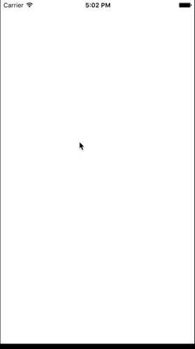

# KDViewPager
ViewPager in iOS like witch in Android.

### preview



### Function

- Convenient datasource, proving `UIViewController`s by index.
- Support `bounce` effects or not;
- Convenient delegate with `will` and `did` notifications.

### Usages

- 3 initial methods.

```
-(instancetype)initWithController:(UIViewController *)controller;
-(instancetype)initWithController:(UIViewController *)controller inView:(UIView *)hostView;
-(instancetype)initWithController:(UIViewController *)controller configView:(void(^)(UIView *hostView, UIView *pagerView))configBlock;
```

By default, KDViewPager match the pagerView to hostView using AutoLayout, but if you want to layout the pagerView yourself, you can use the third one to deal with your staff in configBlock.

- `-(void)reload`, invoke this method when content data has changed. For example, you need to load the count of pages from API and only create content after that. (Delay operation was shown in Demo project).
- delegate and datasource.

#### Example (Code in Demo prject)


```objective-c
@interface ViewController () <KDViewPagerDatasource, KDViewPagerDelegate>
@property (nonatomic, strong) KDViewPager *pager;
@property (nonatomic, assign) NSUInteger count;
@end

@implementation ViewController

- (void)viewDidLoad {
	[super viewDidLoad];
	self.edgesForExtendedLayout = UIRectEdgeNone;
	
	self.count = 5;
	
	_pager = [[KDViewPager alloc] initWithController:self inView:_contentView];
	_pager.datasource = self;
	_pager.delegate = self;
}

#pragma mark - datasource
-(UIViewController *)kdViewPager:(KDViewPager *)viewPager controllerAtIndex:(NSUInteger)index cachedController:(UIViewController *)cachedController {
	if (cachedController == nil) {
		cachedController = [[ContentViewController alloc] initWithIndex:index];
	}
	return cachedController;
}

-(NSUInteger)numberOfPages:(KDViewPager *)viewPager {
	return _count;
}

#pragma mark - delegate
-(void)kdViewpager:(KDViewPager *)viewPager didSelectPage:(NSUInteger)index direction:(UIPageViewControllerNavigationDirection)direction {
	NSLog(@"didSelectpage: %lu direction: %lu", index, direction);
	_pagerControl.value = index;
	_delegateLabel.text = [NSString stringWithFormat:@"Current page index: %lu", index];
}
-(void)kdViewpager:(KDViewPager *)viewPager willSelectPage:(NSUInteger)index direction:(UIPageViewControllerNavigationDirection)direction {
	NSLog(@"willSelectPage: %lu direction: %lu", index, direction);
}

@end
```

**It is Easy and Clean.**

License
---

	Licensed under the Apache License, Version 2.0 (the "License");
	you may not use this file except in compliance with the License.
	You may obtain a copy of the License at

	   http://www.apache.org/licenses/LICENSE-2.0

	Unless required by applicable law or agreed to in writing, software
	distributed under the License is distributed on an "AS IS" BASIS,
	WITHOUT WARRANTIES OR CONDITIONS OF ANY KIND, either express or implied.
	See the License for the specific language governing permissions and
	limitations under the License.